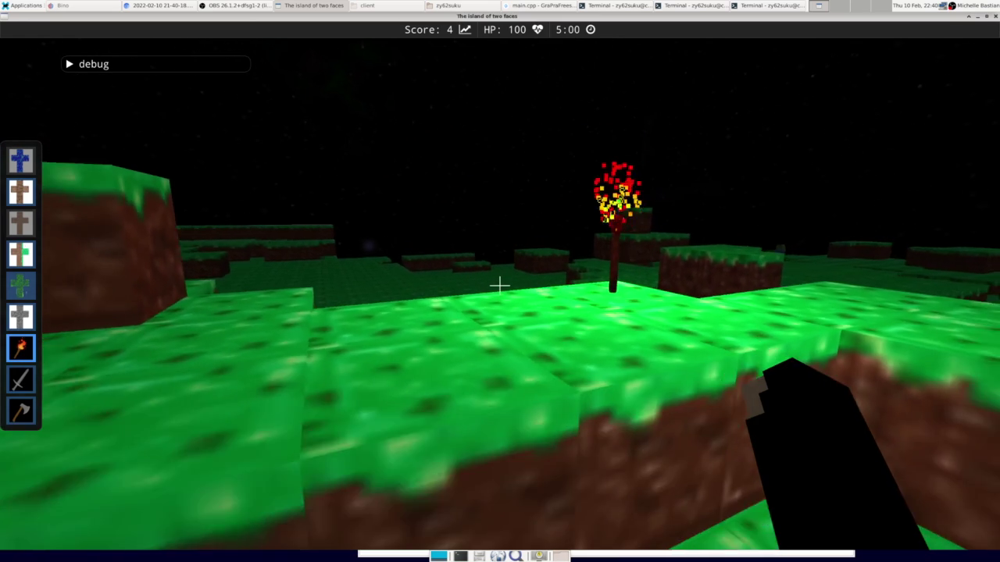

# The Island of Two Faces

A cooperative multiplayer 3D game implemented entirely **from scratch in C++ and OpenGL**.  
This was the final project of my game programming and computer graphics internship spanning over 1000 hours. For this project, we received a time limit of only 3 weeks, where we built all core systems ourselves: rendering, physics, server networking, and gameplay. Our team consisted of 4 people.

---

## Overview

In a Minecraft-style game, players explore an island, collect and place blocks, build structures, and defend themselves against enemies.  
The game supports **up to 4 players** in a multiplayer server.

---

## Screenshots

  
*2 Players building a house.*

  
*A zombie enemy about to attack a player.*

  
*A torch emits light.*

---

## Features

- Custom **OpenGL rendering pipeline**: shadows, point lighting, sky sphere, water reflections/refractions  
- All **3D models designed in Blender**: environment, items, and enemies  
- **Physics system**: collision detection and response for players, enemies, and projectiles  
- **Gameplay**: mining, crafting, building, and combat  
- **Networking**: client-server architecture synchronizing map state, player actions, and animations  
